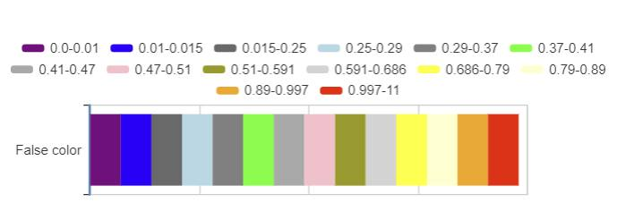

## Image Profile

There are 5 image profiles:
- Rec.709
- Z-Log2
- Z-Log2Cine, one more stop in high light than Z-Log2. (E2-F6 only)
- Flat, same dymanic range as Z-Log2 but with color correction.
- HLG

*When using WDR, the image profile is fixed to Z-Log2*

*When using HLG, the video encoder must support 10 bit encoding, which means it should be ProRes or H.265*

## Dynamic Range
Take E2 as example.

* Based on Z-Log2
* '*' means native ISO
* '**' means ISO with digital gain
* WDR (Wide Dynamic Range) get extra stops in high light
* Z-Log2Cine get one more stop in high light (Compare with Z-Log2)
* The DR under midlle grey is affected by SNR.

*Check [spec](spec) to find out the ISO/WDR information for different model.*

## Video Encoder

| Video Encoder     | 6K/C6K     | 3840x2160       | 4096x2160       | 3840x2160 4K 2.4:1   | 4096x2160 C4K 2.4:1   | 1920x1080 HD |  3696x2772  | 3312x2760 |  2704x1600      |
| :---              | :---:      | :--:            | :--:            | :--:                 | :--:                  | :---:        |     :---:   |    :---:  |     :---:       |
| H.264             | FR <= 30   | FR <= 60        | FR <= 60        | FR <= 60             | FR <= 60              | FR <= 120    |  FR <= 60   | FR <= 60  | FR <= 60        |
| H.265             | FR <= 30   | FR <= 120       | FR <= 120       | FR <= 160            | FR <= 150             | FR <= 240    |  FR <= 60   | FR <= 60  | FR <= 160       |
| ProRes 422 Proxy  | FR <= 30   | FR <= 75        | FR <= 75        | FR <= 75             | FR <= 75              | FR <= 120    |  FR <= 60   | FR <= 60  | FR <= 75        |
| ProRes 422 LT     | FR <= 30   | FR <= 75        | FR <= 60        | FR <= 75             | FR <= 60              | FR <= 120    |  FR <= 60   | FR <= 60  | FR <= 75        |
| ProRes 422        | FR <= 30   | FR <= 60        | FR <= 60        | FR <= 60             | FR <= 60              | FR <= 120    |  FR <= 50   | FR <= 60  | FR <= 75        |
| ProRes 422 HQ     | NA         | FR <= 50        | FR <= 30        | FR <= 60             | FR <= 50              | FR <= 120    |  FR <= 30   | FR <= 30  | FR <= 75        |

- ProRes is only supported in MOV format
- H.264 is not supported when you use HLG

### Bit depth & chroma sample
|                | H.264         | H.265      | ProRes 422   |
|:--             | :--:          | :--:       | :--:         |
| Bit depth      | 8             | 10         | 10           |
| Chroma sample  | 4:2:0         | 4:2:0      | 4:2:2        |

### H.265/H.264 bitrate
| Resolution | FR            | High(Mbps) | Medium(Mbps) | Low(Mbps) |
|:--         | :--:          | :--:       | :--:         |:--:       |
| 8K         | FR <=30       | 500        | 400          | 200       |
| 6K         | FR <=30       | 250        | 160          | 100       |
| 6K         | 30 < FR <=60  | 300        | 190          | 130       |
| 4K         | FR <=30       | 200        | 130          | 60        |
| 4K         | 30 < FR <= 60 | 230        | 150          | 100       |
| 4K         | 60 < FR       | 300        | 200          | 160       |
| 1080P      | FR <=30       | 30         | 20           | 10        |
| 1080P      | 30 < FR <= 60 | 60         | 30           | 15        |
| 1080P      | 60 < FR       | 200        | 130          | 60        |

## HDMI Resolution
The maximum resolution is 4096x2160@60fps 10bit 4:2:2.

Most of time, the HDMI output resolution is determined by EDID from the monitor.

Due to performance limitations, the maximum output would be limited to 720@60fps/1080@50fps/1080@60fps depends on encoder, frame rate and resolution.  

## Audio Encoder
| File Format | AAC | PCM | None |
|:-- |:--:|:--:|:--:|
| MOV | Y | Y | Y |
| MP4 | Y | N | Y |

If you don't want to record the audio, you can choose None.

## Battery Life
Based on a fully charged NP-F970. (E2)

| Resolution | VFR | Duration |
| :-----|:----- | :-----|
| 4KP30 | OFF | 330min |
| 4KP30 | 120 | 200min |

## Control the camera
### HTTP based control
see [HTTP Protocol](protocol/http.md)
#### Ethernet
The Ethernet work in these 3 modes:

- Router, you can plug the E2 into your router, E2 get IP from your router.
- Direct, the E2 work as DHCP server, it assign IP to the client. IP is 10.98.32.1
- Static, use the cfg file in storage card(/MISC/cfg) to setup the static IP.

    eth.ipaddr=192.168.8.8

    eth.netmask=255.255.255.0

    eth.gateway=192.168.8.1

#### USB
The USB port can work as RNDIS, it work with a DHCP server which assign IP to your computer.

Windows/Mac/Linux has buildin driver for RNDIS device. Once you install the driver, you can access the camera with IP 172.18.18.1.

#### WiFi
The WiFi in E2 work as a Access Point, connect your computer/smart phone to E2 to get the IP and access the camera. IP is 10.98.33.1.

#### Find out the IP of camera
- If you can use the menu of the camera, you can find the IP in the 'Connect' menu.
- If your computer is in the same network of E2, you can use [Multicast DNS](https://en.m.wikipedia.org/wiki/Multicast_DNS)(e.g. [Bonjour](https://en.m.wikipedia.org/wiki/Bonjour_(software)#Bonjour_Browser)) to find out the IP.

### LANC
It's compatible with [SONY's LANC](http://www.boehmel.de/lanc.htm).

We add some extend commands to make it easier to control E2, see [extend command](protocol/lanc.md).

### Serial port
In E2 series, we provide two types of serial port:
- Virtual serial, USB CDC ACM
- Real serial, TTL & RS232 level are supported in standard E2, TTL on E2 flagship.

Check the [sample code](protocol/uart/example) for reference.

## Overlay
### Exposure
#### Zebra
We support two Zebra settings:
- over exposure
- under exposure 

#### False Color

We provide this feature both on iOS app and camera.

*Suggestion: Make the skin tone/mid-gray to be green(around 0.4), you can get a better result with zlog:)*

### Peak
We provide this feature both on iOS app and camera.

## Scope
- Waveform
- Parade
- Vector scope

## LUT on preview
x33 size cube format LUT is supported. We have some buildin LUT inside the camera, use it in "System -> Load LUT".

Also, we could import the external LUT to camera and iOS app. Put your LUT file to /MISC/looks/preview, then use the menu to import it.

## User Profile
We group some of the settings to user profile, you can import/export/rename it under /MISC/profile/.

## Multiple camera sync
E2 can do the pixel-synced recording. Cameras work in a chained connection. One master camera and multiple slave cameras. The master will generate the sync signal to all of the slave camera.

Master camera <-> Slave camera 1 <-> Slave camera 2 <-> Slave camera3 <-> ...

### Hardware
1. Sync connector, it contains input and output ports. Contact our sales to buy it.
2. CAT6 or better Ethernet cables.

### Steps

There is a switcher in the battery socket with a lable M/I/S. M: Master, I: single camera, S: Slave.

1. Set switcher to I, power on the camera. Set up the Movie Format and VFR for every camera. All of the cameras should use the same movie format and VFR.
2. Long press power button to power off the camera, set switcher to M or S.
3. Connect the camera in chain, make sure the output port is linked to the input port.
4. Power up the cameras.
5. Before recording, please make sure the free space of the cameras are similar.
6. You can set up the shutter speed to the same value to get a better performance.
7. Press the RECORD button on the Master camera to start multi-camera recording.

On the GUI, you can find out the role under the menu:

    Connect -> Multi Camera
